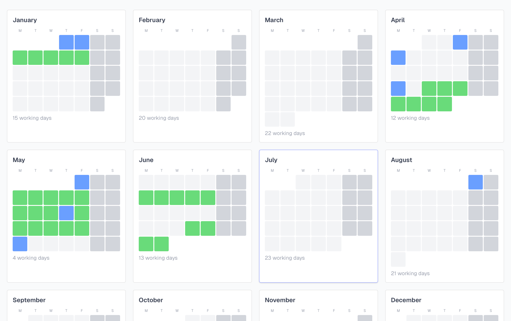

## Why

I needed an API to retrieve my vacation and working days in an n8n workflow. I didn't want to hardcode those days in the workflow — holidays change, vacation plans change, and maintaining that in JSON inside n8n means it's out of date the moment your plans change.

So I built a proper app with an API that n8n can query.

## What It Does

A calendar-based planner that handles the Swiss-specific complexity: public holidays by canton (all 26 cantons supported via openholidays.org), project tracking with colour-coded calendar stripes, and a year view showing billable days per month.

The API exposes working days, vacation days, and project allocations — so any automation tool can pull live data instead of relying on hardcoded values.

## Stack

Next.js with TypeScript, SQLite via Drizzle ORM for zero-config persistence. Dockerized with a Helm chart for homelab deployment. OpenAPI spec at `/openapi.yaml`, Swagger UI at `/docs`.

Feature-complete, used daily for planning my own schedule.
