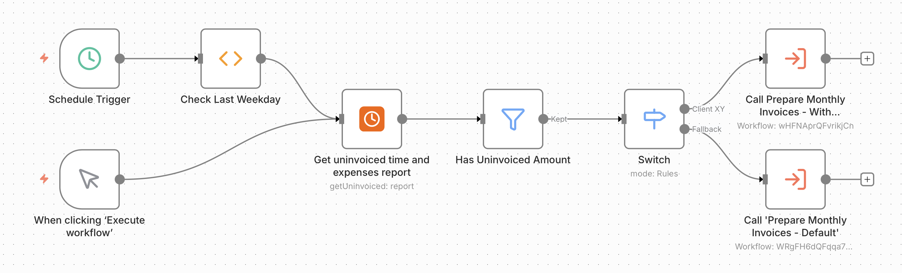
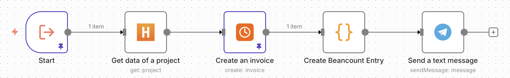
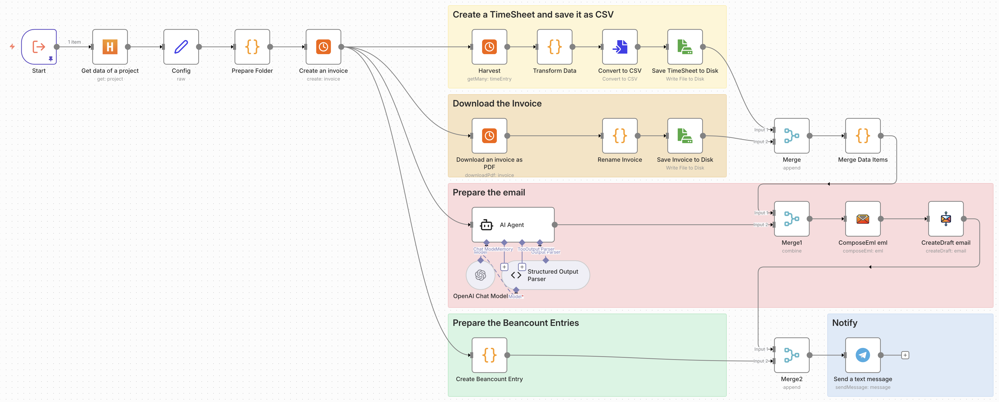

You know that thing where you do the same mindless task every month and think "there has to be a better way"? That was me with invoicing.

For the past few years, I've been using [Harvest](https://www.getharvest.com/) to track time and handle invoicing. Every month-end brought the same routine: hop into Harvest, review each client's unbilled hours, generate invoices, fire them off to clients, then meticulously copy all the details into Beancount (because yes, I'm one of those people who manages finances in plain text). The entire process clocked in around 15 minutes, not exactly painful, but here's the thing: _while there's something oddly satisfying about invoicing_ 😉, I'd much rather spend 2 days building an automation than do those 15 minutes manually for the next few years. Classic engineer math.

So I finally automated it.

## Enter n8n

I'd been hearing about [n8n](https://n8n.io/) for a while but never had a compelling use case. Turns out, repetitive monthly tasks are the perfect excuse to dive in.

The plan was simple: build a workflow that runs on the last weekday of every month, grabs uninvoiced projects from Harvest, creates invoices, prepares Beancount entries, and pings me on Telegram. Easy, right?

Well, almost. The default Harvest integration in n8n wasn't sufficient for what I needed, specifically around parameters and PDF invoice generation. So I did what any reasonable engineer would do: I built my own nodes. You can check them out at [n8n-nodes-harvest](https://www.npmjs.com/package/n8n-nodes-harvest) if you want to use them or peek at the code.

## The Basic Workflow

Here's what the automation does:

- A cron job triggers the workflow on the last weekday of the month
- Grabs all projects with uninvoiced hours from Harvest
- Gets the detailed project information
- Creates a new invoice in Harvest
- Prepares the Beancount entries
- Sends me a Telegram notification that the invoice is ready to review.

*Automated monthly invoicing workflow with scheduled triggers and client-specific routing*

*Core invoice preparation workflow: from Harvest project to Beancount entry and Telegram notification*

## The timesheet variation

Some clients want detailed timesheets with their invoices. For those, I extended the workflow to:

- Generate a CSV timesheet from Harvest time entries
- Download the invoice PDF
- Draft an email with both attachments
- Still prepare Beancount entries and send me a Telegram notification

*Extended workflow for clients requiring timesheets: automated CSV timesheet generation, PDF downloads, AI-generated email drafts, and accounting integration*

The email draft bit is particularly nice. I get a notification, check the draft in my email, make any tweaks if needed, and hit send. Still semi-automated, but it saves me from having to create the timesheet and manually attaching files.

## Future improvements

I'm thinking about adding YAML frontmatter to project descriptions in Harvest to configure things like payment terms per project. Right now it's hardcoded, which works but isn't elegant.

## Try Harvest

If you're a freelancer, a consultant or a small business who needs time tracking, offering estimates and invoicing, I highly recommend [Harvest](https://www.getharvest.com/). It's been my go-to tool for tracking time, creating estimates and generating invoices for years now.

[Try Harvest with my referral link](http://try.hrv.st/4-598457) and get a $10 credit towards your first month!
