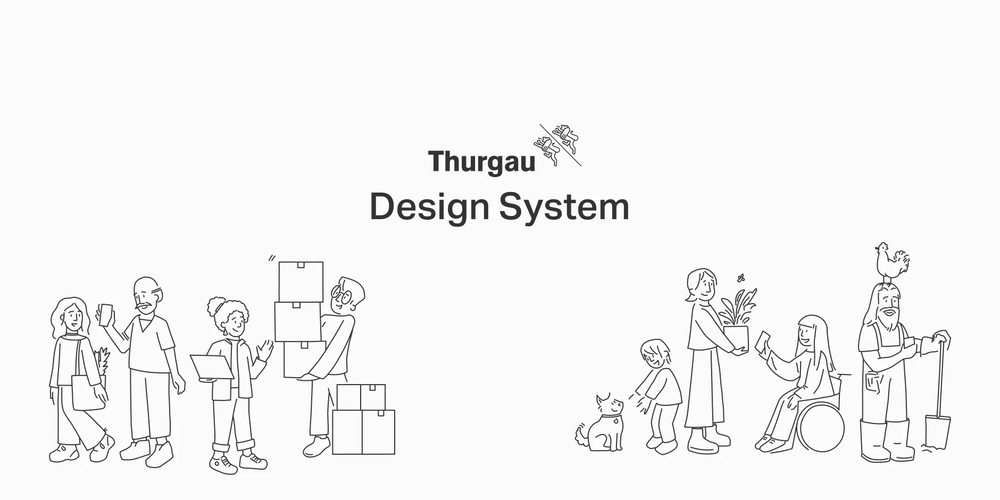
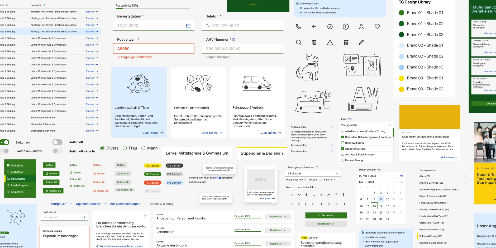
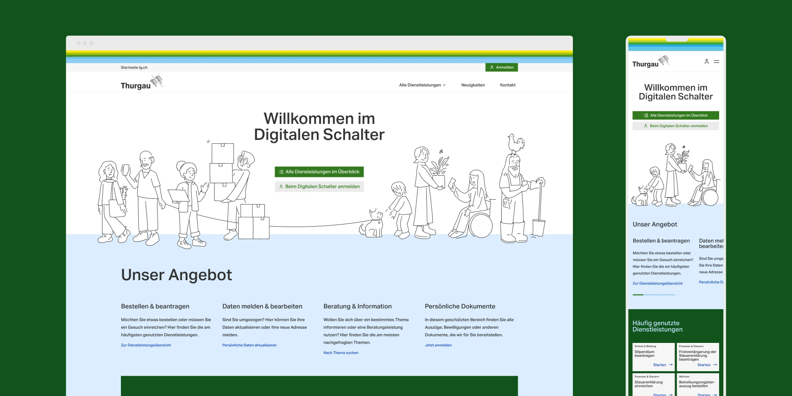
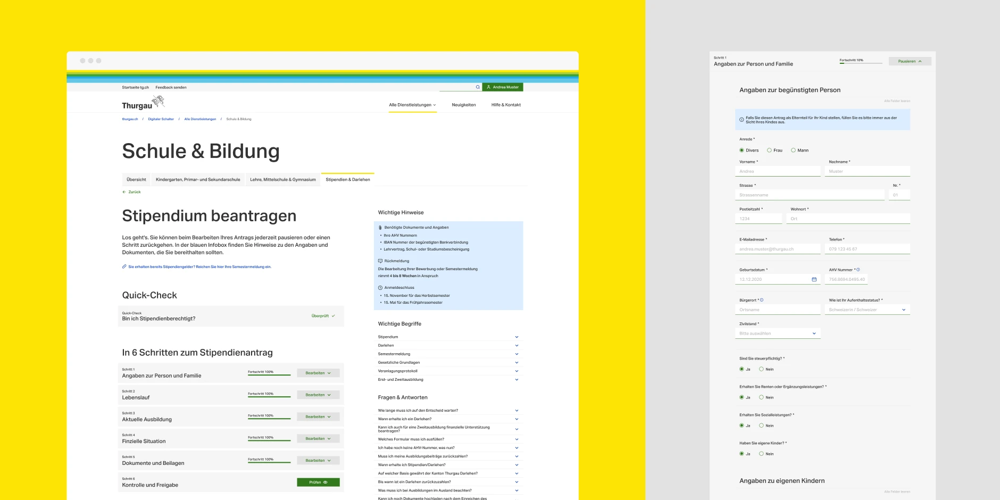
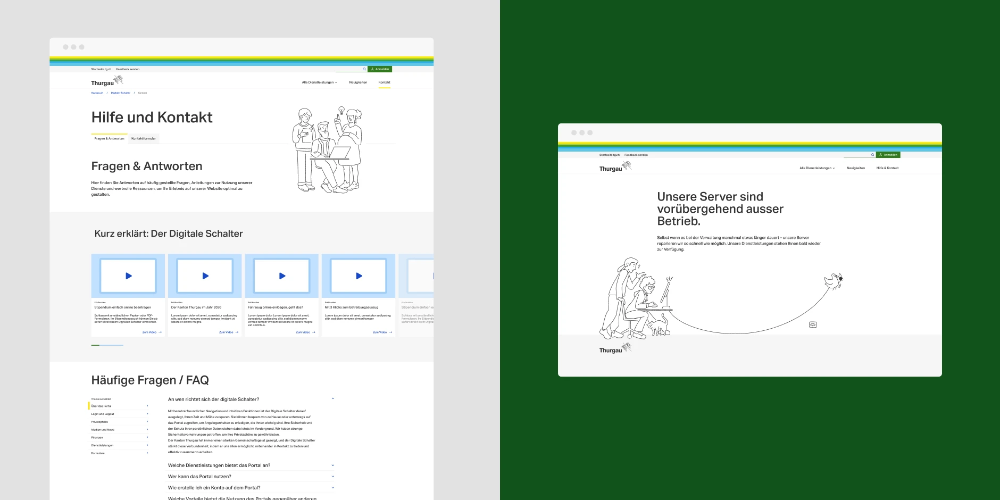

## The Project

The Canton of Thurgau was building the TG Service Portal — an internal IT service portal for their own employees and departments. Think service desk and IT ordering system: internal customers request hardware, report issues, order software licences, that kind of thing. Not citizen-facing — this was infrastructure for the people running the canton.

KiloKilo was brought in to build proof-of-concept applications and lay the foundation for the component library.

## What We Built

**The component library:**
The initial design system for TG Service Portal. Form components, input patterns, data displays, navigation — the building blocks the portal would be assembled from. Built to be accessible, documented, and maintainable by whoever would carry it forward. Government projects have long lifespans; the code has to outlast the project team.

**PoC applications:**
Proof-of-concept implementations showing how the component library would work end-to-end — service catalogue browsing, request flows, the kind of UI patterns an internal IT portal actually needs.

**What that covered:**

- Service catalogue with category filtering
- Multi-step request and ordering flows with progress tracking
- Data tables for managing open requests and history
- FAQ and help content patterns
- User area for tracking active requests

## The Constraints

Public sector work comes with its own requirements: WCAG accessibility, procurement timelines, documentation standards, and the expectation that what you build keeps working without you. A government component library needs to be something another team can pick up cold and understand.

That meant clear architecture, accessible components by default, and documentation that doesn't assume institutional knowledge.

## Portal Walkthrough

<video controls playsinline preload="metadata" poster="/videos/portal-walkthrough-poster.jpg" class="rounded-lg w-full">
  <source src="/videos/portal-walkthrough.mp4" type="video/mp4" />
</video>

## Outcome

PoC delivered. Component library established. The scope here was intentionally limited — lay the foundation, prove the patterns, hand it off in a state where the canton's internal teams (or another agency) could build on it. That's what it was scoped for, and that's what we delivered.
