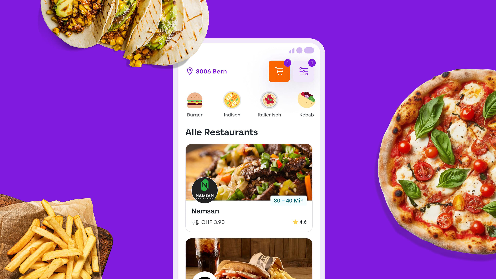
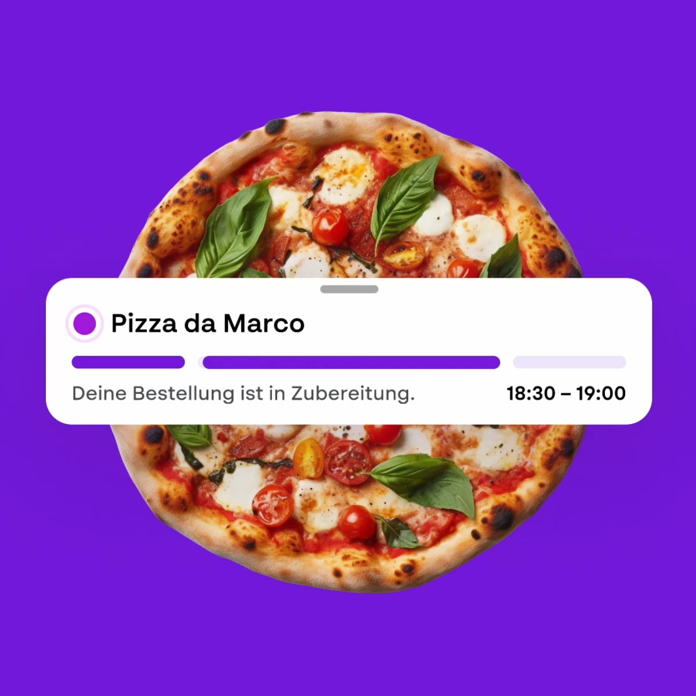
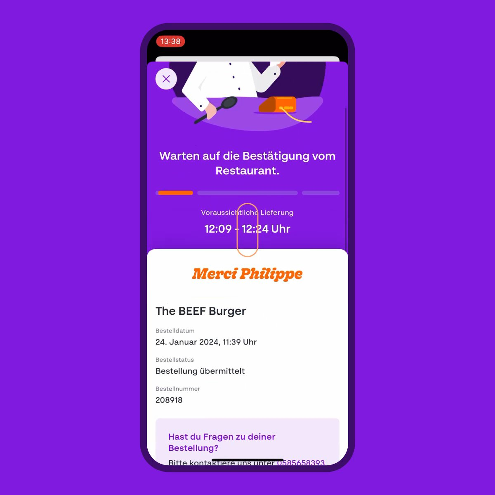

## The Context

Foodnow is Migros's food delivery offering — one of Switzerland's largest grocery retailers bringing delivery to customers' doors. The app needed to ship on both iOS and Android, and "we'll do Android later" wasn't an option.

I joined the project as a freelancer embedded with agency **dreipol**, contributing to both iOS and Android development.

## What We Built

A cross-platform food delivery app with a shared business logic layer. The technical approach used **Kotlin Multiplatform** to share the core logic between platforms — networking, data models, business rules — while keeping native UI layers in Swift (iOS) and Kotlin (Android).

The GraphQL API powered the data layer, handling the complexity of real-time inventory, order state management, and delivery tracking.

## The Technical Approach

Kotlin Multiplatform gave us one place to write and test the business logic. Both platforms consumed it. Changes to the core behaviour propagated to both apps without duplication.

This approach required careful boundary design — what belongs in shared code versus what belongs in native UI. Get the boundary wrong and you end up with duplicated logic and inconsistent behaviour across platforms.

## The Numbers

- 3 months from kickoff to App Store launch
- 4.4 App Store rating
- 75% of all orders placed through the app
- 25% more orders per user compared to web users

## Outcome

The app shipped on iOS and Android with shared business logic. One codebase for the core, native UI on each platform. Foodnow has since been discontinued due to cost-cutting measures at Migros.
