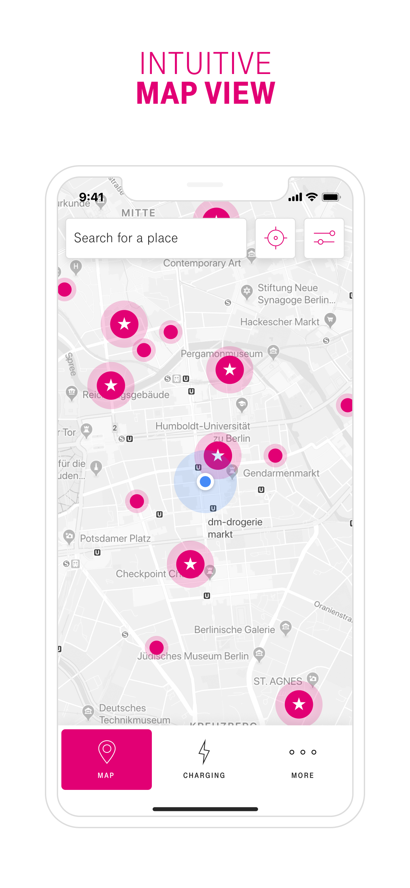
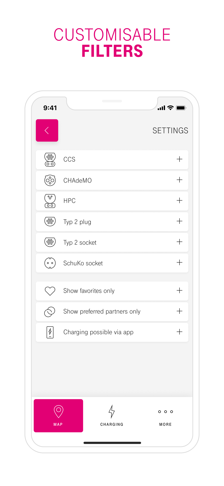
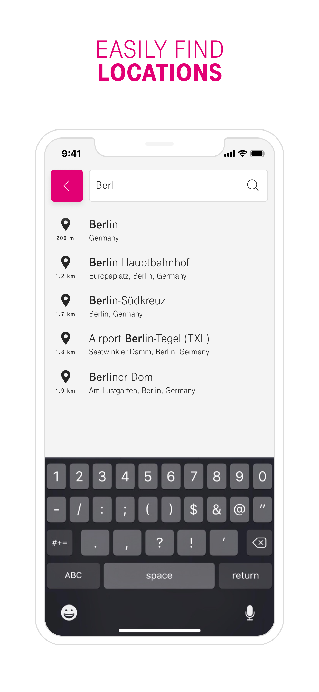
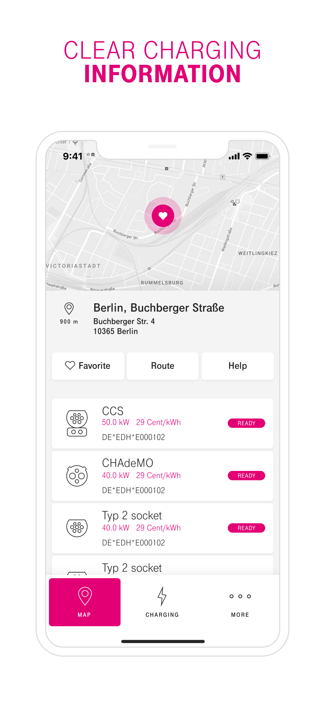
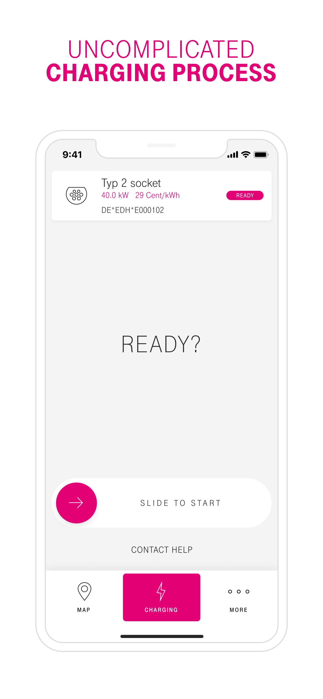
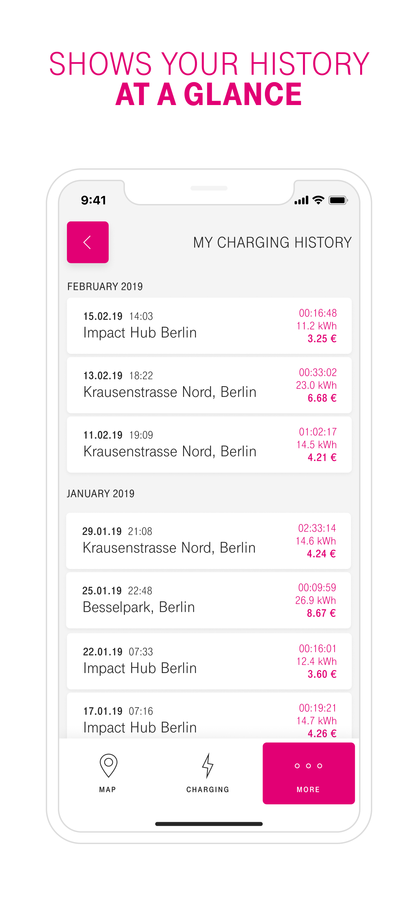

## The Context

Telekom Deutschland didn't own charging stations. They built a roaming service on top of them — one app, one card, access to 56'000+ third-party charging stations across 29 European countries. Same idea as mobile roaming: you have one contract, one monthly bill in euros, and it works everywhere regardless of who operates the station.

The brief came to KiloKilo, the digital studio I co-founded. I led the development.

## What We Built

**The mobile app:**
The primary interface for GET CHARGE customers. Find stations, check availability, start charging sessions, handle payments. Cross-platform iOS and Android with React Native. The complexity was in the roaming layer — different operators, different pricing tiers per country, real-time station availability from third-party networks.

**The landing page:**
Product marketing site for GET CHARGE — built in React.

**Digital branding:**
We shaped the digital brand for GET CHARGE — visual identity, tone of voice, how the product presented itself across app and web. Not just building to spec, but defining what the product should look and feel like.

  

    

    

    

    

    

    

  

  <button class="gallery-arrow gallery-arrow--prev" aria-label="Previous screenshots" type="button">
    <svg width="20" height="20" viewBox="0 0 20 20" fill="none" aria-hidden="true"><path d="M12.5 15L7.5 10L12.5 5" stroke="currentColor" stroke-width="1.75" stroke-linecap="round" stroke-linejoin="round"/></svg>
  </button>
  <button class="gallery-arrow gallery-arrow--next" aria-label="Next screenshots" type="button">
    <svg width="20" height="20" viewBox="0 0 20 20" fill="none" aria-hidden="true"><path d="M7.5 5L12.5 10L7.5 15" stroke="currentColor" stroke-width="1.75" stroke-linecap="round" stroke-linejoin="round"/></svg>
  </button>

## Outcome

Shipped in 2020. 56'000+ stations across 29 countries, ~21'000 in Germany alone. One of the bigger projects we shipped at KiloKilo — and a good example of a telco trying to apply their roaming expertise to a new market.
