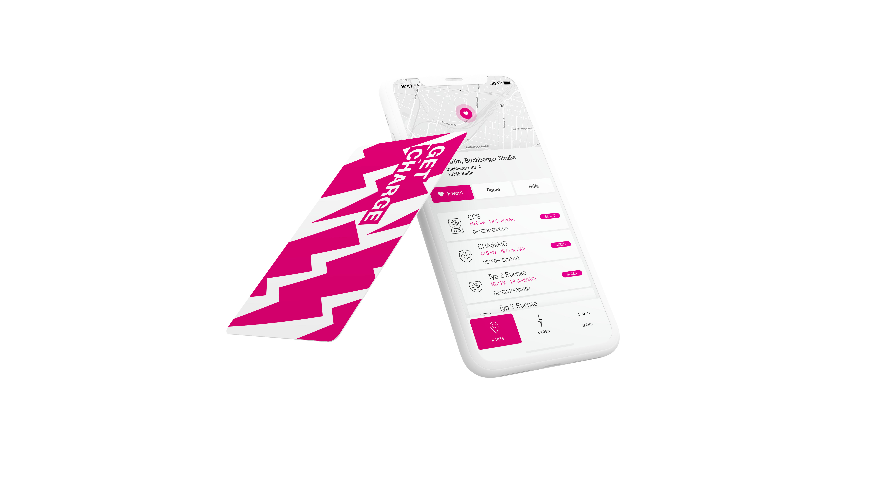

import AppScreenshotGallery from '../../components/AppScreenshotGallery.astro'
import img01 from './images/get-charge/01-map.png'
import img02 from './images/get-charge/02-filter.png'
import img03 from './images/get-charge/03-search.png'
import img04 from './images/get-charge/04-station.png'
import img05 from './images/get-charge/05-charging.png'
import img06 from './images/get-charge/06-history.png'

## The Context

Telekom Deutschland didn't own charging stations. They built a roaming service on top of them — one app, one card, access to 56'000+ third-party charging stations across 29 European countries. Same idea as mobile roaming: you have one contract, one monthly bill in euros, and it works everywhere regardless of who operates the station.

The brief came to KiloKilo, the digital studio I co-founded. I led the development.

## What We Built

**The mobile app:**
The primary interface for GET CHARGE customers. Find stations, check availability, start charging sessions, handle payments. Cross-platform iOS and Android with React Native. The complexity was in the roaming layer — different operators, different pricing tiers per country, real-time station availability from third-party networks.

**The landing page:**
Product marketing site for GET CHARGE — built in React.

**Digital branding:**
We shaped the digital brand for GET CHARGE — visual identity, tone of voice, how the product presented itself across app and web. Not just building to spec, but defining what the product should look and feel like.

<AppScreenshotGallery
	screenshots={[
		{ src: img01, alt: 'Map view — station locations across Europe' },
		{ src: img02, alt: 'Filter panel — filter stations by connector type and operator' },
		{ src: img03, alt: 'Search — find charging stations by location or address' },
		{ src: img04, alt: 'Station detail — availability, pricing, and connector info' },
		{ src: img05, alt: 'Active charging session — live status and cost tracker' },
		{ src: img06, alt: 'Charging history — past sessions and billing summary' },
	]}
/>

## Outcome

Shipped in 2020. 56'000+ stations across 29 countries, ~21'000 in Germany alone. One of the bigger projects we shipped at KiloKilo — and a good example of a telco trying to apply their roaming expertise to a new market.

Telekom later discontinued GET CHARGE — the economics of EV charging roaming weren't there yet at the time. The product worked; the market wasn't ready.
